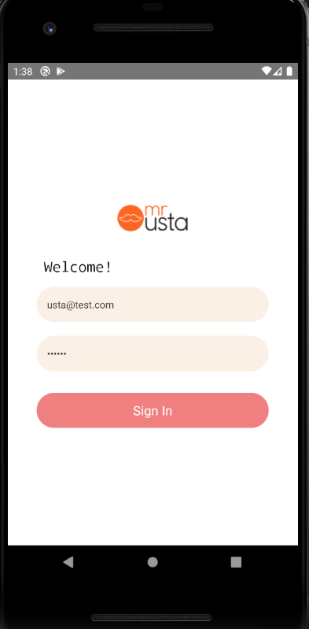
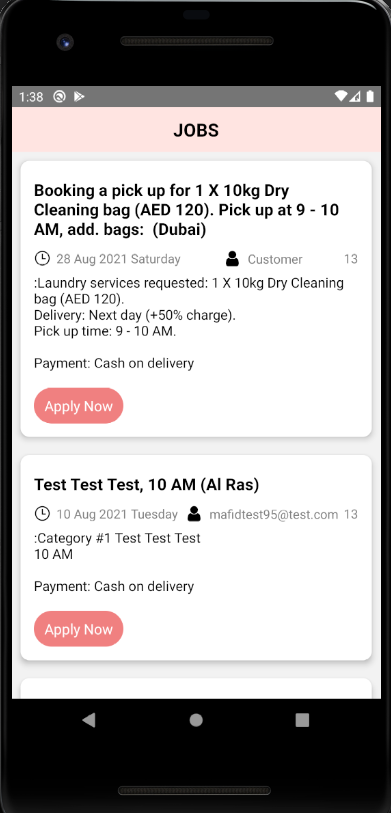

# Mr.Usta
 
 ### App build according to the assignment
 
<div>



</div>

 

## Running Project
In this project, you send a login request to the desired API address with a username and password. You then pull the Jobs information from the Api using the incoming token and display it on the screen.

After the project is downloaded, the project is opened with the 'Visual Studio Code' editor.

At the terminal;
```
npm install

```
The packages used in the project with the command line are created in the "node_modules" folder.
```
npx react-native start
```
command is run.
```
npx react-native run-android
```
command is run.